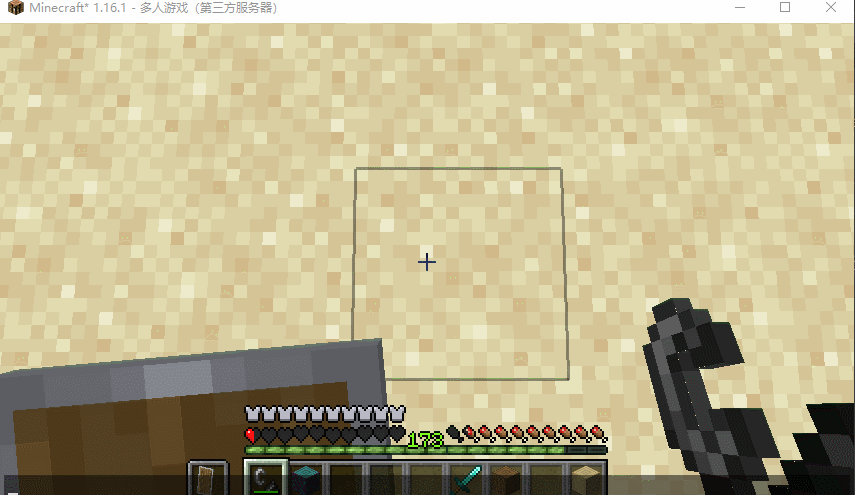

# plusls carpet addition

这是一个 [Carpet mod](https://github.com/gnembon/fabric-carpet) (fabric-carpet) 的扩展 mod，包含了不少~~NotVanilla的~~有意思的功能以及特性

跟同 Minecraft 版本的 carpet mod 一起使用即可。尽可能地使用较新的 carpet mod

该 mod 给 carpet 添加了 multiconnect 支持

## 依赖

fabric-api >= 0.39.2

carpet >= 1.4.45+v210811

## 索引

### [规则](#规则列表)

- [PCA 同步协议](#PCA-同步协议-pcaSyncProtocol)
- [PCA 同步协议可同步玩家数据](#PCA-同步协议可同步玩家数据-pcaSyncPlayerEntity)
- [空潜影盒可堆叠](#空潜影盒可堆叠-emptyShulkerBoxStack)
- [潜影盒使用染料染色](#潜影盒使用染料染色-useDyeOnShulkerBox)
- [不死图腾扳手](#不死图腾扳手-flippingTotemOfUndying)
- [刷怪的最大Y值](#刷怪的最大Y值-spawnYMax)
- [刷怪的最小Y值](#刷怪的最小Y值-spawnYMin)
- [全局刷怪群系](#全局刷怪群系-spawnBiome)
- [快速叶子腐烂](#快速叶子腐烂-quickLeafDecay)
- [墓碑](#墓碑-gravestone)
- [Xaero 小地图世界名](#Xaero-小地图世界名-xaeroWorldName)
- [村民被绿宝石块吸引](#村民被绿宝石块吸引-villagersAttractedByEmeraldBlock)
- [超级拴绳](#超级拴绳-superLead)
- [增强骨粉](#增强骨粉-powerfulBoneMeal)
- [白天睡觉](#白天睡觉-sleepingDuringTheDay)
- [发射器修复铁傀儡](#发射器修复铁傀儡-dispenserFixIronGolem)
- [发射器收集经验](#发射器收集经验-dispenserCollectXp)
- [玩家操作限制器](#玩家操作限制器-playerOperationLimiter)
- [玩家坐下](#玩家坐下-playerSit)
- [PCA 调试模式](#PCA-调试模式-pcaDebug)

## 规则列表

### PCA 同步协议 (pcaSyncProtocol)

plusls carpet addition sync protocol

PCA 同步协议是一个用于在服务端和客户端之间同步 Entity，BlockEntity 的协议，目前被 [MasaGadget](https://github.com/plusls/MasaGadget) 用于实现多人游戏容器预览。

- 类型: `boolean`
- 默认值: `false`
- 参考选项: `true`, `false`
- 分类: `PCA`, `protocal`

### PCA 同步协议可同步玩家数据 (pcaSyncPlayerEntity)

该选项能决定哪些玩家的数据将会被 PCA 同步协议同步

NOBODY：所有玩家数据都无法同步

BOT：地毯 mod 召唤出的 bot 的数据可以被同步

OPS：地毯 mod 召唤出的 bot 的数据可以被同步， op 可以同步所有玩家的数据

OPS_AND_SELF：地毯 mod 召唤出的 bot 和玩家自己的数据可以被同步，op 可以同步所有玩家的数据

EVERYONE：所有人的数据都可以被同步

- 类型: `enum`
- 默认值: `OPS`
- 参考选项: `nobody`, `bot`, `ops`, `ops_and_self`, `everyone`
- 分类: `PCA`, `protocal`

### 空潜影盒可堆叠 (emptyShulkerBoxStack)

Carpet 默认实现的潜影盒可堆叠只能让潜影盒在地面上堆叠，无法在背包中以及容器中手动堆叠

对于 CarpetExtra 实现的潜影盒可堆叠则过于激进，它会导致空潜影盒从漏斗进入箱子时会自动堆叠，这样一来会影响比较器的输出导致一些机器坏掉

因此额外实现了一次 emptyShulkerBoxStack，开启本功能后既能手动堆叠潜影盒，同时不会影响漏斗和比较器的逻辑

本功能无法让潜影盒在地面上堆叠，建议结合 Carpet 的潜影盒堆叠使用

本功能需要客户端支持潜影盒堆叠，例如 tweakeroo

或者在客户端安装本 mod

- 类型: `boolean`
- 默认值: `false`
- 参考选项: `true`, `false`
- 分类: `PCA`, `feature`, `need_client`

### 潜影盒使用染料染色 (useDyeOnShulkerBox)

可以使用染料直接对地上的潜影盒染色，用水瓶右键洗去地上潜影盒的颜色

- 类型: `boolean`
- 默认值: `false`
- 参考选项: `true`, `false`
- 分类: `PCA`, `feature`

### 不死图腾扳手 (flippingTotemOfUndying)

允许使用不死图腾调整方块朝向，并且不会产生方块更新

主手图腾副手为空则则会翻转方块，主手图腾副手不为空且为方块则放出的方块会被反转

- 类型: `boolean`
- 默认值: `false`
- 参考选项: `true`, `false`
- 分类: `PCA`, `feature`

### 刷怪的最大Y值 (spawnYMax)

刷怪的最大 Y 值，会影响刷怪塔效率，114514 为默认

- 类型: `int`
- 默认值: `114514`
- 参考选项: `114514`, `1919810`
- 分类: `PCA`, `feature`

### 刷怪的最小Y值 (spawnYMin)

刷怪的最小 Y 值，会影响刷怪塔效率，114514 为默认

- 类型: `int`
- 默认值: `114514`
- 参考选项: `114514`, `1919810`
- 分类: `PCA`, `feature`

### 全局刷怪群系 (spawnBiome)

全局刷怪群系，会影响整个游戏，DEFAULT 为默认

- 类型: `enum`
- 默认值: `DEFAULT`
- 参考选项: `DESERT`, `PLAINS`
- 分类: `PCA`, `feature`

### 快速叶子腐烂 (quickLeafDecay)

在砍树后树叶会快速掉落

- 类型: `boolean`
- 默认值: `false`
- 参考选项: `true`, `false`
- 分类: `PCA`, `feature`

### 墓碑 (gravestone)

玩家死亡后会在死亡附近的位置生成墓碑，其中将保留玩家身上的物品以及一半的经验

- 类型: `boolean`
- 默认值: `false`
- 参考选项: `true`, `false`
- 分类: `PCA`, `feature`

死亡时生成墓碑：

挖开墓碑掉落物品：

### Xaero 小地图世界名 (xaeroWorldName)

设置 Xaero 世界名来同步世界 ID，“#none”表示不同步

- 类型: `String`
- 默认值: `#none`
- 参考选项: `#none`
- 分类: `PCA`, `PROTOCOL`

### 村民被绿宝石块吸引 (villagersAttractedByEmeraldBlock)

村民会被玩家手中的绿宝石块吸引

- 类型: `boolean`
- 默认值: `false`
- 参考选项: `true`, `false`
- 分类: `PCA`, `feature`

### 超级拴绳 (superLead)

村民和怪物可以被拴绳拴住（拴怪物需要客户端也安装 PCA）

- 类型: `boolean`
- 默认值: `false`
- 参考选项: `true`, `false`
- 分类: `PCA`, `feature`, `need_client`

### 防止铁砧过于昂贵 (avoidAnvilTooExpensive)

铁砧修复花费可以高于 40 并且不会因为过于昂贵无法使用（如果客户端不安装此 mod 则会显示过于昂贵，但是实际上可以使用）

- 类型: `boolean`
- 默认值: `false`
- 参考选项: `true`, `false`
- 分类: `PCA`, `feature`, `need_client`

### 增强骨粉 (powerfulBoneMeal)

骨粉可以催熟甘蔗，仙人掌，紫颂花

- 类型: `boolean`
- 默认值: `false`
- 参考选项: `true`, `false`
- 分类: `PCA`, `feature`, `dispenser`

### 白天睡觉 (sleepingDuringTheDay)

玩家白天睡觉时时间会切换到晚上

- 类型: `boolean`
- 默认值: `false`
- 参考选项: `true`, `false`
- 分类: `PCA`, `feature`

### 发射器修复铁傀儡 (dispenserFixIronGolem)

发射器会消耗铁锭来修复铁傀儡

- 类型: `boolean`
- 默认值: `false`
- 参考选项: `true`, `false`
- 分类: `PCA`, `feature`, `dispenser`

### 发射器收集经验 (dispenserCollectXp)

发射器消耗玻璃瓶来收集经验，产出附魔之瓶

- 类型: `boolean`
- 默认值: `false`
- 参考选项: `true`, `false`
- 分类: `PCA`, `feature`, `dispenser`

### 玩家操作限制器 (playerOperationLimiter)

每 gt 玩家可以放置 2 个方块，秒破 1 个方块，这两个操作每 gt 只能做一种（用于防人肉盾构机和玩家自动破基岩 mod）

- 类型: `boolean`
- 默认值: `false`
- 参考选项: `true`, `false`
- 分类: `PCA`, `feature`

### 玩家坐下 (playerSit)

在快速潜行 3 次后玩家可以坐下

- 类型: `boolean`
- 默认值: `false`
- 参考选项: `true`, `false`
- 分类: `PCA`, `feature`

### PCA 调试模式 (pcaDebug)

开启后会打印调试信息

- 类型: `boolean`
- 默认值: `false`
- 参考选项: `true`, `false`
- 分类: `PCA`

## License

This template is available under the CC0 license. Feel free to learn from it and incorporate it in your own projects.
